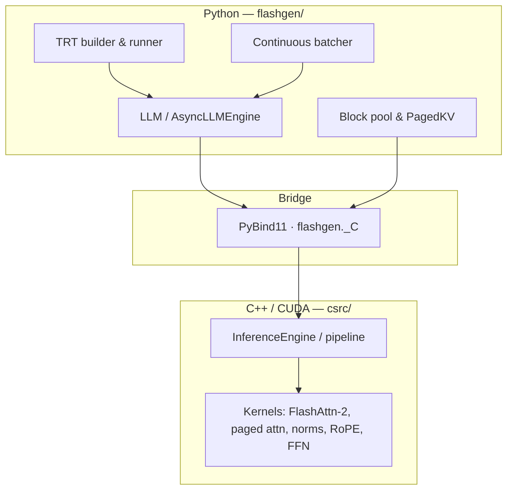
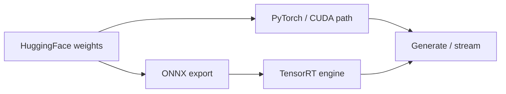

# FlashGen

LLM inference stack: **HuggingFace → ONNX / TensorRT**, **custom CUDA kernels**, **paged KV cache** and **continuous batching** (ideas from [TensorRT-LLM](https://github.com/NVIDIA/TensorRT-LLM) and [vLLM](https://github.com/vllm-project/vllm)).

---

## Architecture



**Inference path (conceptual)**



---

Models are HuggingFace–centric (e.g. GPT-2, LLaMA-2, Mistral-style); see `flashgen/model_loader/` for mappings.

## What’s inside

| Area | Notes |
|------|--------|
| **TRT** | FP16 / INT8 engines; KV stays outside TRT in paged blocks |
| **Kernels** | FlashAttention-2–style attention, paged prefill/decode, fused norms & FFN (`csrc/kernels/`) |
| **KV** | Block tables, low fragmentation, prefix sharing (radix + refcount) |
| **Batching** | WAITING → RUNNING → PREEMPTED scheduler, chunked prefill |
| **Streaming** | Token-by-token; TTFT / TPOT oriented |

---

## Install

**Needs:** NVIDIA GPU, CUDA 12.x, Python ≥ 3.9, CMake ≥ 3.22, `pybind11` (see `requirements.txt`). Use a **real** `cmake` binary (e.g. `/usr/bin/cmake`); if the only `cmake` on `PATH` is a broken conda shim, set `CMAKE_EXECUTABLE`.

```bash
pip install -r requirements.txt
GPU_ARCH=<sm> pip install -e .   # examples below
```

| `GPU_ARCH` | Typical GPUs |
|:----------:|--------------|
| 80 | A100, A10G |
| 86 | RTX 3090, A6000 |
| 89 | RTX 4090, L40S |
| 90 | H100 |

**Optional TensorRT:** `pip install tensorrt --index-url https://pypi.ngc.nvidia.com`

**Manual CMake** (kernel work): `mkdir build && cd build && cmake .. -DGPU_ARCH=80 && cmake --build . --target flashgen_ext -j$(nproc)`

---

## Quick start

```python
from flashgen import LLM, SamplingParams

llm = LLM("gpt2", backend="pytorch")
params = SamplingParams(temperature=0.8, top_p=0.9, max_tokens=100)

print(llm.generate("The future of AI is", params).text)

for piece in llm.stream("Once upon a time", params):
    print(piece, end="", flush=True)
```

**ONNX → TensorRT**

```python
llm = LLM("gpt2")
llm.export_onnx("engines/gpt2.onnx")
llm.build_trt_engine("engines/gpt2.onnx", "engines/gpt2_fp16.trt", precision="fp16", max_batch=32, max_seq=1024)
llm_trt = LLM("gpt2", backend="trt", trt_engine_path="engines/gpt2_fp16.trt")
```

---

## Layout

```
flashgen/     Python API, loaders, ONNX/TRT, memory, scheduler, sampling
csrc/         CUDA kernels, runtime, PyBind11 bindings
CMakeLists.txt, setup.py, requirements.txt
```

---

## References

- [FlashAttention-2](https://arxiv.org/abs/2307.08691) · [PagedAttention / vLLM](https://arxiv.org/abs/2309.06180) · [Orca (continuous batching)](https://www.usenix.org/conference/osdi22/presentation/yu) · [GQA](https://arxiv.org/abs/2305.13245) · [TensorRT-LLM](https://github.com/NVIDIA/TensorRT-LLM)
